# 🏠 StayEase Property Service


---

# 📖 Overview

The **StayEase Property Service** is responsible for managing all property-related business operations within the StayEase microservices ecosystem.

As the central domain of the StayEase platform, the Property Service owns the complete lifecycle of properties, including property registration, room management, amenity management, customer reviews, property approval workflows, and advanced property discovery.

The service collaborates with the Owner Service to validate property ownership and owner eligibility while integrating with the User Service to retrieve reviewer information. It provides well-defined internal APIs that allow other microservices to consume property-related information without directly accessing its database.

Designed using Spring Boot and Spring Data JPA, the Property Service follows enterprise microservices principles by maintaining dedicated ownership of the property domain, enabling independent scalability, clear business boundaries, and maintainable service evolution.

---

# 🎯 Business Problem

Managing properties in a hostel and PG booking platform involves much more than simply storing property information.

The platform must ensure that:

- Only verified owners can register properties.
- Properties undergo an approval workflow before becoming publicly available.
- Rooms are managed independently within each property.
- Amenities remain reusable across multiple properties.
- Customer reviews accurately reflect property quality.
- Average property ratings remain consistent after every review operation.
- Property discovery supports filtering, pagination, and sorting.
- Property information is shared with other services without duplicating data.

Without a dedicated Property Service, these responsibilities would become tightly coupled with owner management or booking operations, leading to poor scalability, duplicated business logic, and increased maintenance complexity.

---

# 💡 Business Solution

The StayEase Property Service centralizes all property-related business functionality into a dedicated microservice while collaborating with other domain services through OpenFeign.

The service is responsible for:

- Property Registration
- Property Retrieval
- Property Updates
- Property Approval
- Property Rejection
- Property Activation
- Property Deactivation
- Soft Delete
- Room Management
- Amenity Management
- Property Review Management
- Average Rating Management
- Dynamic Property Search
- Owner Property Portfolio
- Property Summary APIs
- Room Summary APIs

This separation allows property management to evolve independently while maintaining strong domain boundaries and providing scalable, enterprise-grade property management capabilities.

---

# 🏢 Enterprise Concepts Demonstrated

This project demonstrates several enterprise backend engineering concepts commonly adopted in production systems.

- Database per Service
- Property Domain Management
- Layered Architecture
- OpenFeign Client Communication
- Property Approval Workflow
- Specification-Based Dynamic Search
- Spring Data JPA
- Bean Validation
- Global Exception Handling
- Centralized Logging
- Service-to-Service Communication
- Externalized Configuration
- Optimistic Locking
- Soft Delete Strategy
- Review & Rating Management
- Domain-Driven Service Separation

---

# 🎯 Project Objectives

The Property Service has been designed with the following objectives:

- Centralize property management.
- Maintain complete ownership of the property domain.
- Manage rooms independently within each property.
- Support reusable amenity management.
- Enable customer reviews and property ratings.
- Enforce property approval workflows.
- Provide advanced property search capabilities.
- Integrate seamlessly with Owner and User Services.
- Demonstrate enterprise-grade property domain architecture.

---

# ✨ Features

## 🏠 Property Management

- Property Registration
- Property Retrieval
- Property Update
- Property Approval
- Property Rejection
- Property Activation
- Property Deactivation
- Soft Delete
- Owner Property Listing
- Property Summary APIs

---

## 🛏 Room Management

- Room Creation
- Room Retrieval
- Room Details
- Room Summary
- Property-Room Association
- Optimistic Locking

---

## 🛋 Amenity Management

- Create Amenities
- Retrieve Amenities
- Link Amenities to Properties
- Many-to-Many Property-Amenity Mapping

---

## ⭐ Review Management

- Add Property Reviews
- Update Reviews
- Delete Reviews
- Retrieve Property Reviews
- Automatic Average Rating Calculation
- Duplicate Review Prevention
- Owner Review Restriction

---

## 🔍 Property Discovery

- Dynamic Property Search
- Multi-Criteria Filtering
- Pagination
- Sorting
- Specification-Based Search

---

## 🔄 Service Communication

- Owner Service Integration
- User Service Integration
- OpenFeign-Based Communication
- Property Summary APIs
- Room Summary APIs

---

## 🚀 Reliability

- Centralized Exception Handling
- Business-Specific Exceptions
- Bean Validation
- Structured Logging
- Standardized API Responses
- Soft Delete Strategy

---

# 🛠 Technology Stack

| Category | Technology |
|-----------|------------|
| Language | Java 21 |
| Framework | Spring Boot 3.2.5 |
| Security | Spring Security + JWT |
| Database | MySQL |
| ORM | Spring Data JPA |
| Service Communication | OpenFeign |
| Service Discovery | Netflix Eureka Client |
| Dynamic Search | Spring Data JPA Specifications |
| Validation | Bean Validation |
| Build Tool | Gradle |

---

# 🏛 High-Level Architecture

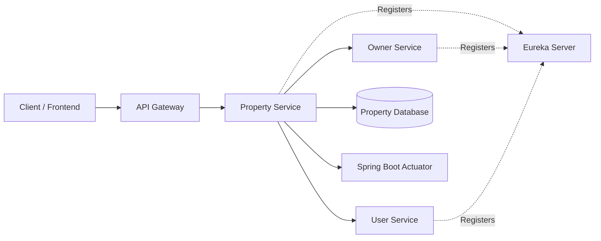

---

# 🏠 Property Service Responsibilities

The Property Service acts as the central property management service for the StayEase platform.

Its primary responsibilities include:

- Managing property information.
- Managing property approval workflows.
- Managing rooms within each property.
- Managing reusable amenities.
- Managing customer reviews.
- Maintaining average property ratings.
- Providing advanced property search.
- Validating property ownership.
- Integrating reviewer information.
- Providing property summary information to other services.

By isolating all property-related business functionality into a dedicated microservice, the StayEase platform maintains clear domain ownership while enabling independent scalability and long-term maintainability.

---

# 🌟 Why a Dedicated Property Service?

Separating property management into its own microservice provides several enterprise advantages.

- Clear Separation of Concerns
- Independent Database Ownership
- Centralized Property Domain
- Reusable Amenity Management
- Independent Room Management
- Scalable Property Search
- Standardized Review Management
- Reduced Service Coupling

---
# 📂 Project Structure

```text
stayease-property-service
│
├── gradle/
│
├── src
│   ├── main
│   │
│   ├── java
│   │   └── com
│   │       └── stayease
│   │           └── property_service
│   │
│   │               ├── config
│   │               │   ├── FeignConfig.java
│   │               │   ├── OpenApiConfig.java
│   │               │   ├── OwnerClient.java
│   │               │   └── UserClient.java
│   │               │
│   │               ├── controller
│   │               │   ├── PropertyController.java
│   │               │   ├── RoomController.java
│   │               │   ├── ReviewController.java
│   │               │   └── AmenityController.java
│   │               │
│   │               ├── dto
│   │               │   ├── request
│   │               │   └── response
│   │               │
│   │               ├── entity
│   │               │
│   │               ├── exception
│   │               │
│   │               ├── integration
│   │               │   ├── OwnerServiceGateway.java
│   │               │   └── UserServiceGateway.java
│   │               │
│   │               ├── repository
│   │               │
│   │               ├── security
│   │               │   ├── HeaderAuthenticationFilter.java
│   │               │   └── SecurityConfig.java
│   │               │
│   │               ├── service
│   │               │
│   │               ├── specification
│   │               │   └── PropertySpecification.java
│   │               │
│   │               └── PropertyServiceApplication.java
│   │
│   ├── resources
│   │   └── application.yml
│   │
│   └── test
│
├── README.md
├── build.gradle
├── settings.gradle
└── LICENSE
```

---

# 📦 Package Responsibilities

| Package | Responsibility |
|----------|----------------|
| **config** | Contains OpenFeign clients, Feign configuration, Swagger/OpenAPI configuration, request interceptors, and application-level infrastructure configuration. |
| **controller** | Exposes REST APIs for property management, room management, review management, amenity management, search operations, approval workflows, and internal service APIs. |
| **dto** | Contains request and response models exchanged between clients and other microservices. |
| **entity** | Defines JPA entities and enumerations representing properties, rooms, amenities, reviews, and business states. |
| **exception** | Provides centralized exception handling and business-specific exception classes. |
| **integration** | Implements the Service Gateway layer responsible for communication with Owner Service and User Service using OpenFeign, Retry, and Circuit Breaker patterns. |
| **repository** | Contains Spring Data JPA repositories responsible for persistence operations. |
| **security** | Implements Header Authentication Filter, JWT parsing, role-based authorization, and Spring Security configuration. |
| **service** | Implements the complete business logic for property lifecycle, rooms, amenities, reviews, approval workflow, search, and validations. |
| **specification** | Implements dynamic filtering using Spring Data JPA Specifications for advanced property search. |
| **resources** | Stores Spring Boot configuration, profiles, logging, Feign, Eureka, Resilience4j, and environment-specific properties. |
| **test** | Contains unit tests and integration tests for controllers, services, repositories, and security components. |

---

# 🏗 Layered Architecture

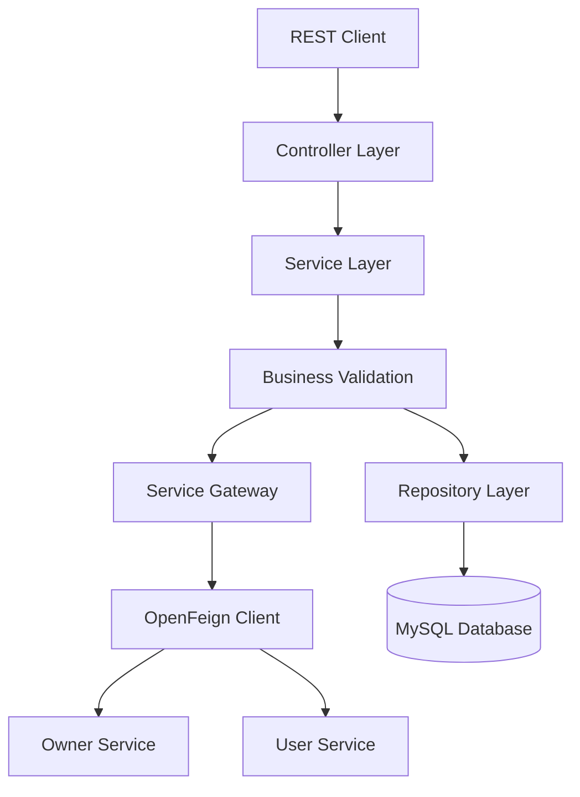

This separation ensures loose coupling, improved maintainability, easier testing, and independent scalability.

---

# 📚 Package Overview

The Property Service follows a modular and layered package structure where each package owns a single business responsibility.

---

## 📁 config

Responsible for configuring application infrastructure.

Includes:

- OpenFeign Clients
- Feign Configuration
- Swagger / OpenAPI
- Request Interceptors
- Header Propagation

---

## 📁 controller

Acts as the REST entry point for all property-related APIs.

Responsibilities include:

- Property Management
- Room Management
- Amenity Management
- Review Management
- Property Approval Workflow
- Property Search
- Internal APIs

---

## 📁 dto

Contains Request and Response DTOs exchanged between clients and microservices.

Examples include:

- PropertyRequest
- PropertyResponse
- PropertySearchRequest
- RoomRequest
- AmenityRequest
- ReviewRequest

---

## 📁 entity

Represents the Property domain model.

Current entities include:

- Property
- Room
- Review
- Amenity

Supporting enums include:

- PropertyStatus
- WashroomType

---

## 📁 repository

Implements persistence using Spring Data JPA.

Repositories include:

- PropertyRepository
- RoomRepository
- ReviewRepository
- AmenityRepository

---

## 📁 integration

Implements the Service Gateway pattern.

Gateway classes include:

- OwnerServiceGateway
- UserServiceGateway

Responsibilities:

- Retry
- Circuit Breaker
- Fallback Methods
- Service Abstraction

---

## 📁 specification

Contains Specification-based dynamic query generation.

Responsibilities include:

- Dynamic Filters
- Search Criteria
- Pagination
- Sorting

---

## 📁 security

Protects internal APIs using:

- HeaderAuthenticationFilter
- JWT Parsing
- Spring Security
- Role-Based Authorization

---

## 📁 service

Contains all business rules.

Major responsibilities:

- Property Lifecycle Management
- Property Approval
- Room Management
- Review Management
- Amenity Management
- Property Search
- Rating Calculation
- Owner Validation
- User Validation

---

## 📁 exception

Provides centralized exception handling.

Includes:

- Business Exceptions
- Validation Exceptions
- Resource Exceptions
- External Service Exceptions
- GlobalExceptionHandler

The GlobalExceptionHandler converts exceptions into standardized API responses across the application.

---
# 🔄 Property Request Lifecycle

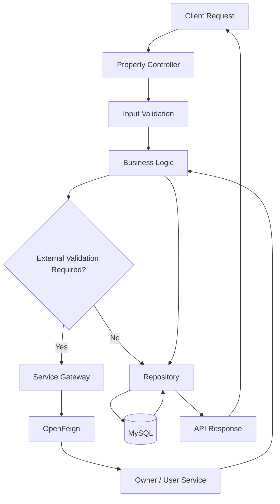

---

# 🏠 Property Registration Flow

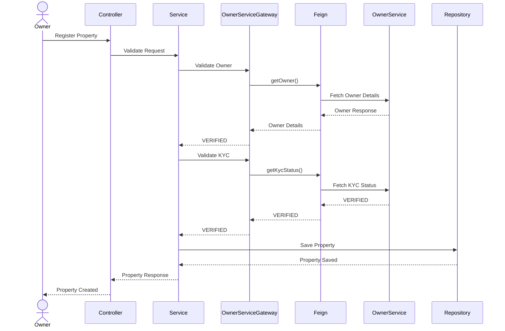

---
# 🏠 Property Lifecycle

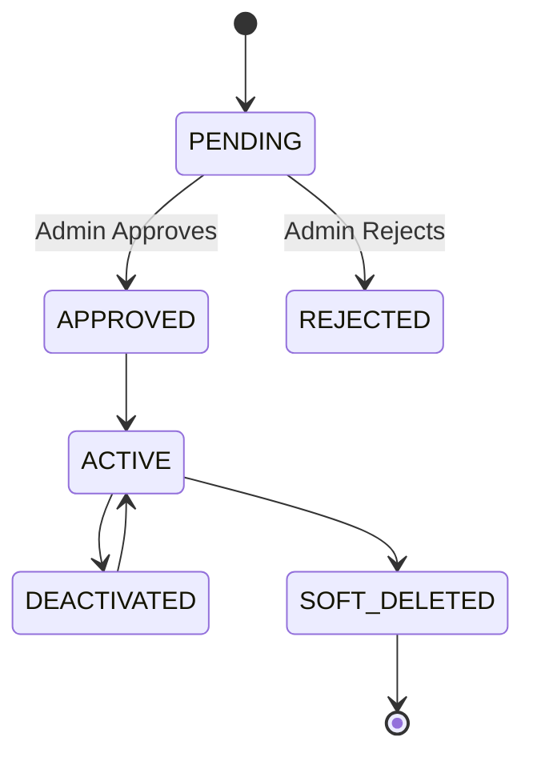

This workflow ensures that only verified and approved properties become visible to customers while preserving historical information through soft deletion.

---


# ✅ Property Approval Flow

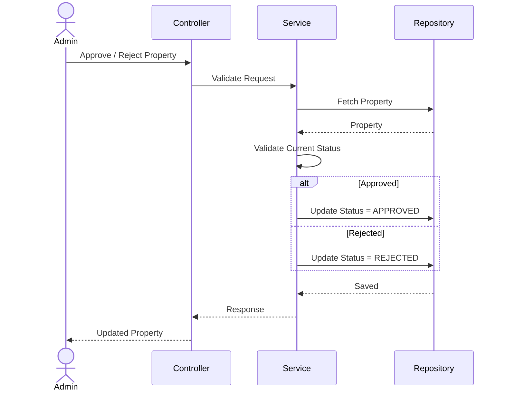

---

# 🛏 Room Management Flow

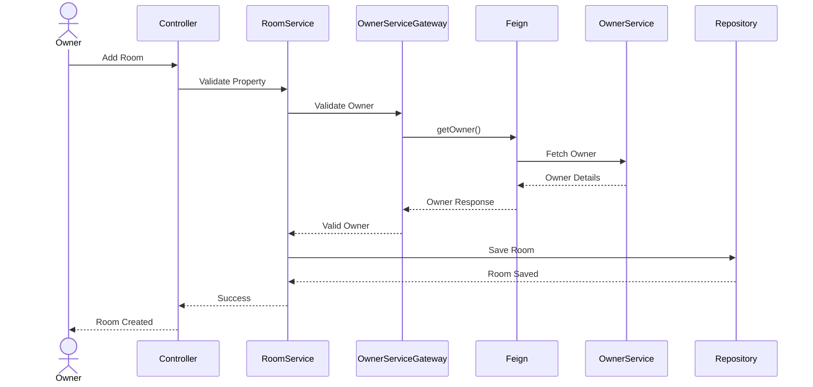

---

# 🛋 Amenity Management Flow

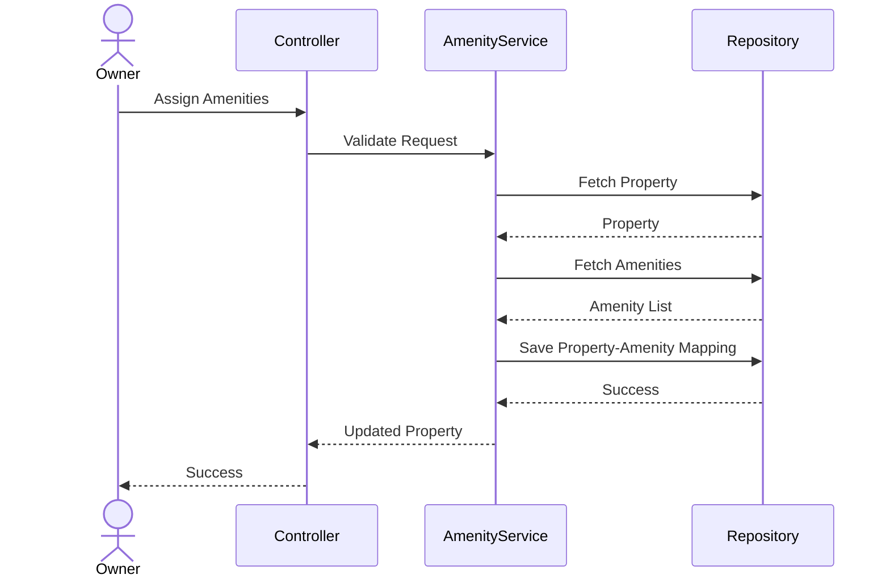
---

# ⭐ Review Management Flow

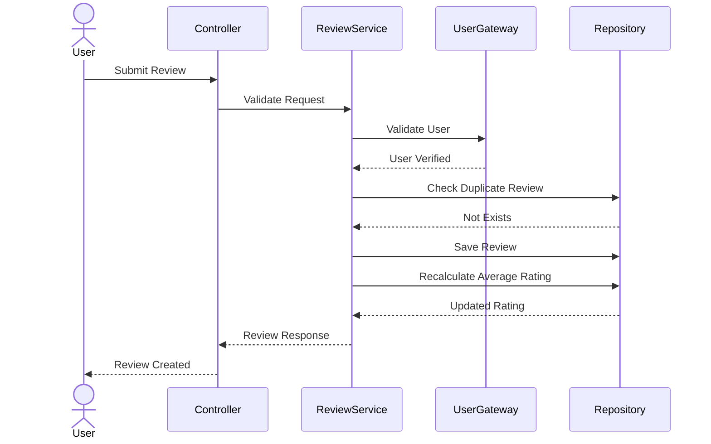

---

## Review Validation Rules

Every review submitted to the Property Service is validated before being persisted.

Business rules include:

- A customer can review a property only once.
- Property owners cannot review their own properties.
- Reviews can only be updated by their original author.
- Reviews can only be deleted by their original author.
- Average property ratings are recalculated after every create, update, and delete operation.

These validations ensure fairness, consistency, and accurate property ratings across the platform.

---

# 🔍 Property Search Flow


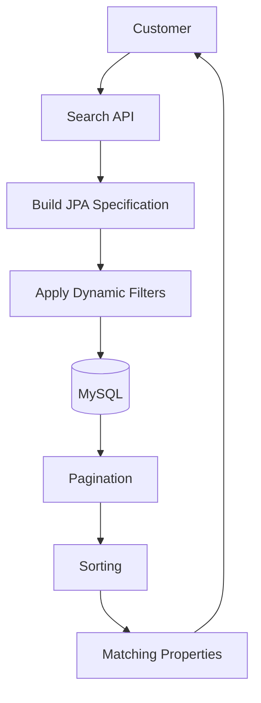

---

# 🎯 Why Separate Property Management?

Separating property management into its own microservice provides several enterprise advantages.

- Clear separation between property management and owner management.
- Independent ownership of property-related business data.
- Centralized room and amenity management.
- Dedicated property approval workflow.
- Consistent review and rating management.
- Scalable property discovery and search capabilities.
- Reduced coupling between domain services.
- Simplified integration with Owner and User Services.
- Enterprise-ready microservices architecture.

---

# 🛡 Security Strategy

Although authentication is centralized within the StayEase Auth Service, the Property Service implements multiple security layers to protect property-related business operations.

Rather than validating user credentials directly, the Property Service trusts authenticated requests forwarded by the API Gateway and Auth Service while securing internal service-to-service communication through dedicated security mechanisms.

The implemented security mechanisms include:

- Header-Based Internal Authentication
- Spring Security
- Protected Internal APIs
- Input Validation
- Business-Level Authorization
- Centralized Exception Handling

This layered security approach ensures the Property Service remains focused on business operations while relying on centralized authentication across the StayEase ecosystem.

---

# 🏠 Property Management Strategy

The Property Service is responsible for managing the complete lifecycle of properties within the StayEase platform.

Instead of distributing property-related responsibilities across multiple services, the Property Service owns every business operation related to properties.

Responsibilities include:

- Property Registration
- Property Updates
- Property Approval
- Property Rejection
- Property Activation
- Property Deactivation
- Soft Delete
- Property Search

This centralized ownership provides better scalability, stronger business consistency, and cleaner domain boundaries.

---

# 🛏 Room Management Strategy

Rooms represent the physical accommodation units available inside a property.

Rather than embedding room information directly within property records, the Property Service manages rooms as independent entities associated with a property.

Responsibilities include:

- Room Creation
- Room Retrieval
- Room Details
- Room Summary
- Property Association

Managing rooms independently provides:

- Better normalization
- Easier room expansion
- Improved maintainability
- Independent room lifecycle management

---

## Property Availability Strategy

The Property Service owns the static definition of properties and rooms.

Dynamic room availability is intentionally delegated to the Booking Service, which calculates availability based on active bookings rather than maintaining mutable availability counts inside the Property Service.

This separation establishes a clear ownership boundary between property management and booking management.

---

# ⭐ Review Management Strategy

Customer reviews are a critical component of the property domain.

The Property Service maintains reviews independently while ensuring each review follows strict business validation rules.

Responsibilities include:

- Review Creation
- Review Updates
- Review Deletion
- Duplicate Review Prevention
- Owner Review Restriction
- Dynamic Rating Calculation

After every review operation, the property's average rating is recalculated to ensure rating accuracy across the platform.

---

# 🛋 Amenity Management Strategy

Amenities represent reusable facilities that can be associated with multiple properties.

Instead of duplicating amenity information for every property, the Property Service maintains a centralized amenity catalog.

Responsibilities include:

- Amenity Creation
- Amenity Retrieval
- Property-Amenity Association
- Many-to-Many Relationship Management

This design improves normalization, eliminates duplication, and simplifies future amenity expansion.

---

# 🗄 Database Design

The Property Service maintains only property-related business data.

| Entity | Responsibility |
|----------|----------------|
| Property | Stores property information and lifecycle details. |
| Room | Stores room-specific information for each property. |
| Review | Stores customer reviews and ratings. |
| Amenity | Maintains reusable amenities shared across properties. |
| PropertyStatus | Enumeration representing property lifecycle states. |
| WashroomType | Enumeration representing supported washroom types. |

The service intentionally avoids storing owner profile information, authentication data, booking records, or payment information.

Instead, this information is retrieved dynamically from the respective domain services.

This follows the **Database per Service** pattern commonly adopted in enterprise microservices architectures.

---

# 🔄 Service Communication

The Property Service communicates with multiple services using **OpenFeign**.

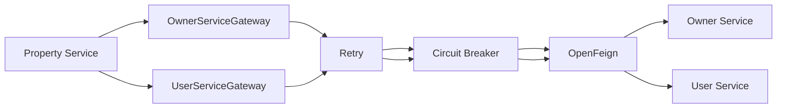

Using OpenFeign provides:

- Declarative REST Clients
- Reduced Boilerplate
- Better Maintainability
- Loose Coupling
- Service Abstraction

---
# 🛡 Resilience Strategy

The Property Service uses Resilience4j to improve fault tolerance during service-to-service communication.

Implemented patterns include:

- Retry
- Circuit Breaker
- Gateway Pattern
- Fallback Methods
- Configurable Timeouts

Every downstream service call is routed through a dedicated Service Gateway before reaching the OpenFeign client. This architecture isolates external dependencies, improves maintainability, and provides graceful failure handling during service outages.

---
# 🌍 Spring Profiles

The application supports multiple runtime environments using Spring Profiles.

| Profile | Purpose |
|----------|----------|
| local | Local Development |
| cut | Component Unit Testing |
| ete | End-to-End Testing |
| drt | Development Regression Testing |
| test | Automated Testing |
| prod | Production Deployment |

Environment-specific configuration enables the application to run across multiple deployment stages without source code modifications.

---

# ⚙ Externalized Configuration

The Property Service externalizes all environment-specific configuration.

Examples include:

- Database Configuration
- Logging Levels
- Feign Client URLs
- Spring Profiles
- Security Configuration
- Server Configuration

Externalized configuration simplifies deployment across local, testing, staging, and production environments.

---

# 📋 Logging Strategy

The Property Service implements structured logging to simplify debugging and operational monitoring.

The following business events are logged.

## Property Management

- Property Creation
- Property Updates
- Property Approval
- Property Rejection
- Property Activation
- Property Deactivation

---

## Room Management

- Room Creation
- Room Updates
- Room Retrieval

---

## Review Management

- Review Creation
- Review Updates
- Review Deletion
- Rating Recalculation

---

## Service Communication

- Outgoing Feign Requests
- Incoming Feign Responses
- External Service Failures

---

## Error Handling

- Validation Failures
- Business Exceptions
- Property Workflow Violations
- External Service Errors

Sensitive business information is never logged.

---

# 🚨 Exception Handling Strategy

The Property Service implements centralized exception handling using a Global Exception Handler.

Business-specific exceptions include:

- PropertyNotFoundException
- RoomNotFoundException
- ReviewNotFoundException
- AmenityNotFoundException
- DuplicateReviewException
- InvalidPropertyStateException

Centralized exception handling provides:

- Consistent API Responses
- Simplified Maintenance
- Improved Client Experience
- Reduced Boilerplate
- Better Error Traceability

---

# 🏭 Production Readiness

The StayEase Property Service incorporates several production-oriented practices.

Implemented:

- Layered Architecture
- OpenFeign Integration
- Spring Security
- Header Authentication
- Bean Validation
- Global Exception Handling
- Specification-Based Search
- Structured Logging
- Environment Profiles
- Externalized Configuration
- DTO Separation
- Repository Pattern
- Netflix Eureka Service Discovery
- Spring Boot Actuator
- Resilience4j Retry
- Resilience4j Circuit Breaker
- Gateway Layer
- Header Propagation
- Correlation ID Propagation
These practices provide a solid foundation for scalable enterprise deployments.

---

# 🚀 Future Enhancements

The following enhancements are planned for future iterations.

### Performance

- Redis Property Cache
- Search Result Caching
- Query Optimization

---

### Property Features

- Property Image Storage
- Image Compression
- Geo-Location Search
- Nearby Places Integration
- Recommendation Engine

---

### Observability

- Prometheus
- Grafana
- Micrometer Metrics
- OpenTelemetry
- Distributed Tracing

---

### Infrastructure

- Docker
- Kubernetes
- Kafka Event Streaming
- CI/CD Pipeline
- Centralized Configuration

These enhancements will further improve scalability, performance, and operational visibility.

---

# 🏠 Property Management Design Principles

The StayEase Property Service was designed following modern enterprise microservices principles.

Rather than acting as a simple CRUD service, it owns the complete **Property Domain**, ensuring clear separation of responsibilities while collaborating with other domain services.

The following architectural decisions influenced its implementation.

---

## Why Separate Property Service from Owner Service?

Property ownership and property management solve different business problems.

The Owner Service manages:

- Owner Profiles
- KYC Verification
- Owner Dashboard
- Revenue Summary

The Property Service manages:

- Properties
- Rooms
- Amenities
- Reviews
- Property Search

Separating these responsibilities improves maintainability, scalability, and independent deployment.

---
## Why Validate Owners Before Property Registration?

Every property belongs to a verified owner.

Before creating a property, the Property Service communicates with the Owner Service to verify:

- Owner existence
- Owner verification status
- Owner eligibility

This prevents invalid property registrations while maintaining clear ownership across the StayEase platform.

---

## Why Specification-Based Search?

Customers search properties using different combinations of filters such as location, rent, amenities, property status, and ratings.

Using Spring Data JPA Specifications enables dynamic query generation without creating numerous repository methods.

Benefits include:

- Dynamic filtering
- Cleaner repository layer
- Better maintainability
- Easier feature expansion
- Improved scalability

Using JPA Specifications provides:

- Dynamic query generation
- Flexible filtering
- Better maintainability
- Easier feature expansion

---

## Why Database per Service?

Each microservice owns its own database.

The Property Service stores only:

- Properties
- Rooms
- Amenities
- Reviews

It intentionally avoids storing:

- Owner Data
- Booking Records
- Payment Information

This reduces coupling and allows each service to evolve independently.

---

## Why Separate Room Entity?

A property can contain multiple rooms with different configurations.

Managing rooms independently allows:

- Independent room lifecycle management
- Future room-level pricing
- Room-specific amenities
- Flexible occupancy management
- Better normalization

This keeps the Property entity lightweight while allowing the room domain to evolve independently.

---

## Why Separate Review Entity?

Reviews represent customer feedback rather than property metadata.

Keeping reviews independent:

- Prevents unnecessary property updates
- Simplifies review management
- Enables review moderation
- Supports future review analytics
- Maintains proper database normalization

---

## Why Reusable Amenities?

Amenities such as Wi-Fi, Parking, Laundry, Air Conditioning, and Power Backup are shared across multiple properties.

Maintaining a reusable amenity catalog:

- Eliminates duplication
- Simplifies maintenance
- Improves normalization
- Supports future amenity expansion

---

## Why Many-to-Many Amenity Mapping?

Amenities can be shared across multiple properties.

Using a many-to-many relationship:

- Eliminates data duplication
- Simplifies amenity management
- Supports future amenity additions
- Improves database normalization

---

## Why Dynamic Rating Calculation?

Property ratings continuously evolve as customers add, update, or delete reviews.

Calculating ratings dynamically ensures:

- Accurate ratings
- Consistent customer experience
- No stale aggregate values

---


## Why OpenFeign?

OpenFeign provides declarative REST clients that simplify inter-service communication.

Advantages include:

- Minimal Boilerplate
- Strong Abstraction
- Easier Testing
- Cleaner Code
- Maintainable Integrations

---

# 🏢 Enterprise Design Summary

The StayEase Property Service follows modern enterprise microservices principles by maintaining dedicated ownership of the property domain, managing rooms, amenities, and reviews independently, integrating with Owner and User Services through OpenFeign, and enforcing business workflows through a layered architecture.

Key architectural decisions include:

- Dedicated Property Domain
- Database per Service Pattern
- Layered Architecture
- OpenFeign Communication
- Property Approval Workflow
- Specification-Based Search
- Review & Rating Management
- Header-Based Internal Security
- DTO Separation
- Global Exception Handling
- Structured Logging
- Environment-Based Configuration

Together, these design principles establish a scalable, maintainable, and production-ready property management platform capable of supporting future enhancements such as Redis caching, property recommendations, event-driven communication, and cloud-native deployments.

---

# 🚀 Getting Started

Follow the steps below to set up and run the StayEase Property Service locally.

---

# 📋 Prerequisites

Ensure the following software is installed on your machine before running the project.

| Software | Version |
|----------|---------|
| Java | 21 or later |
| Gradle | 8.x or later |
| MySQL | 8.x |
| Git | Latest |
| IDE | IntelliJ IDEA (Recommended) |
| Postman | Latest |

The following StayEase services should also be available for full functionality:

- API Gateway
- Auth Service
- Owner Service
- User Service

---

# 📥 Clone Repository

```bash
git clone https://github.com/PSaiRam32/stayease-property-service.git

cd stayease-property-service
```

---

# ⚙ Configure Application

Open the following file:

```text
src/main/resources/application.yml
```

Configure the following properties according to your environment.

### Database

```yaml
spring:
  datasource:
    url:
    username:
    password:
```

---

### Feign Clients

Configure the URLs of the dependent services.

- Owner Service
- User Service

---

### Spring Profile

Choose the appropriate profile.

```yaml
spring:
  profiles:
    active: local
```

---

# 🗄 Database Setup

Create a MySQL database.

```sql
CREATE DATABASE stayease_property_service;
```

The application will automatically create the required tables using Hibernate.

---

# ▶ Run the Application

Using Gradle:

```bash
./gradlew bootRun
```

or

Run

```
PropertyServiceApplication.java
```

directly from IntelliJ IDEA.

The service starts on the configured port defined in `application.yml`.

---

# 🌐 API Endpoints

The Property Service exposes REST APIs for complete property domain management.

Major API categories include:

## 🏠 Property Management

- Register Property
- Get Property
- Update Property
- Search Properties
- Approve Property
- Reject Property
- Activate Property
- Deactivate Property
- Soft Delete Property

---

## 🛏 Room Management

- Add Room
- Get Property Rooms
- Get Room Details
- Room Summary APIs

---

## 🛋 Amenity Management

- Create Amenity
- Get Amenity
- Get All Amenities
- Assign Amenities to Property

---

## ⭐ Review Management

- Add Review
- Update Review
- Delete Review
- Get Property Reviews

---

## 🔄 Internal APIs

- Owner Property APIs
- Property Summary APIs
- Room Summary APIs
- Owner Validation APIs

Swagger/OpenAPI documentation is available after starting the application.

---

# 🧪 Testing

The project supports multiple levels of testing.

### Unit Testing

Tests individual service components in isolation.

---

### Integration Testing

Validates interaction between

- Controller
- Service
- Repository
- Database

---

### API Testing

REST APIs can be tested using

- Postman
- Swagger UI

---

### Service Integration Testing

OpenFeign integrations should be verified with:

- Owner Service
- User Service

---

# 📊 Monitoring

For production deployments, the following monitoring stack is recommended.

- Spring Boot Actuator
- Prometheus
- Grafana
- Centralized Logging
- Distributed Tracing

These tools provide visibility into application health, request metrics, JVM performance, and service interactions.

---

# 📈 Performance Considerations

The Property Service is designed with performance and scalability in mind.

Current optimizations include:

- Layered Architecture
- DTO-Based Communication
- Repository Pattern
- OpenFeign Client Integration
- JPA Specifications
- Externalized Configuration

Future optimizations may include:

- Redis Property Cache
- Search Result Caching
- Database Query Optimization
- Lazy Loading Improvements
- Property Recommendation Engine

---

# 🔒 Security Best Practices

The following practices are implemented or recommended.

- Secure Internal APIs
- Header-Based Authentication
- Input Validation
- Bean Validation
- Business Rule Validation
- Secure Exception Handling
- Centralized Security Configuration
- Sensitive Data Protection
- Principle of Least Privilege

---

# 🤝 Contributing

Contributions are welcome.

If you would like to contribute:

1. Fork the repository.
2. Create a feature branch.
3. Commit your changes.
4. Push the branch.
5. Open a Pull Request.

Please follow the project's coding standards and commit message conventions.

---

# 📄 License

This project is licensed under the MIT License.

See the **LICENSE** file for complete details.

---

# 👨‍💻 Author

**Sai Ram Paidipati**

Java Backend Developer

### GitHub

https://github.com/PSaiRam32

### LinkedIn

https://www.linkedin.com/in/sairam-paidipati/

---

# 📬 Support

If you encounter any issues or have suggestions for improvement:

- Create a GitHub Issue
- Submit a Pull Request
- Reach out through GitHub Discussions

Feedback and contributions are always appreciated.

---

# 🎯 Learning Outcomes

This project demonstrates practical implementation of enterprise backend engineering concepts, including:

- Spring Boot Microservices
- Property Domain Management
- Layered Architecture
- Domain-Driven Design Principles
- Spring Security
- OpenFeign Communication
- Specification Pattern
- REST API Design
- DTO Pattern
- Repository Pattern
- Global Exception Handling
- Structured Logging
- Environment Profiles
- Externalized Configuration
- Production-Oriented Project Organization

---

# 📚 References

The following technologies and frameworks were used while developing the Property Service.

- Java 21
- Spring Boot
- Spring Security
- Spring Data JPA
- OpenFeign
- Hibernate
- MySQL
- Gradle
- OpenAPI / Swagger
- Lombok

Refer to the official documentation of each technology for additional details and best practices.

---

# 📝 Project Summary

The StayEase Property Service provides a dedicated business domain for managing rental properties within the StayEase microservices ecosystem.

It centralizes property lifecycle management, room management, amenity management, review management, and property discovery while maintaining independent ownership of all property-related business data.

By integrating with the Owner Service and User Service through OpenFeign, the Property Service ensures validated property ownership, reliable review management, and seamless collaboration with other business domains without duplicating data.

The architecture emphasizes clean layering, approval workflows, specification-based searching, centralized exception handling, structured logging, and production-ready design principles, making it well-suited for modern cloud-native applications.

---

# 🙏 Acknowledgements

This project was built as part of the **StayEase Backend Microservices** to explore enterprise property management, domain-driven service design, and scalable property lifecycle management in distributed systems.

Special focus areas include:

- Property Lifecycle Management
- Property Approval Workflow
- Room Management
- Amenity Management
- Customer Review & Rating Management
- Specification-Based Dynamic Search
- OpenFeign Service Communication
- Database per Service Pattern
- Layered Architecture
- Spring Data JPA
- Bean Validation
- Global Exception Handling
- Structured Logging
- Production-Oriented Microservice Design

This project served as a practical implementation of enterprise property management concepts commonly adopted in modern microservices architectures.

Thank you for exploring this repository. Feedback, suggestions, and contributions are always appreciated.
